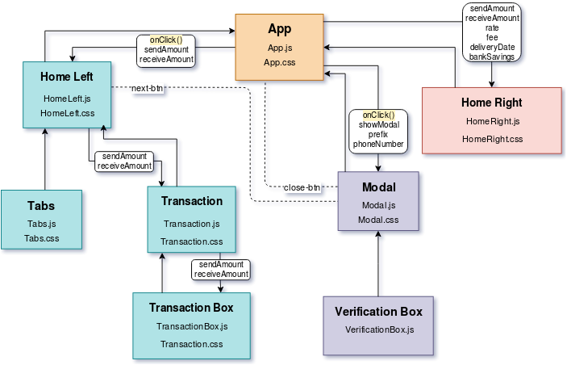
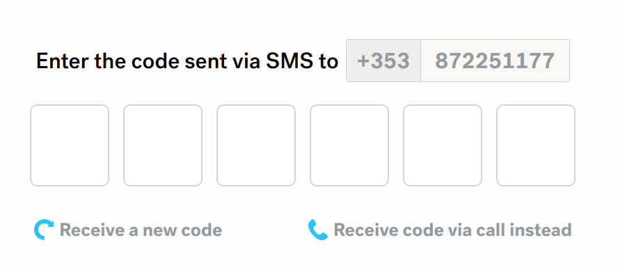

## Currency Fair Code Test

#### Live Page:

https://hashdoge.github.io/currency-fair-frontend/

#### Description 

A Technical Test as part of the interview process for Currency Fair. This project was created using NPM, ReactJS, HTML and CSS. 

No UI frameworks were used.

Technical Architecture
-

#### Component Structure

App.js is the main parent component in this project that feeds directly into Index.js, 
every other component is a child of this. 

I started off with all the JavaScript, HTML, and CSS in 'App.js' once I laid out the basic foundation 
of the main layout I began breaking condensing different sections into sub-components that fed into 'App.js'.

I chose how to break up the sections into components based on the 'classnames' used for the CSS. E.G. The left 
of the home page was called 'home-left' and it was not dependant on any other sections of the code, so I split the HTML
into the 'HomeLeft.js' component, I then created a CSS file specifically for the styling of this component. The same process
was used for the rest of the sub-components.

The only Outlier to this is the "VerificationBox.js" as this was used to minimise the HTML code needed for the boxes shown below:

A loop was used to repeat the HTML code needed until all the boxes were created. 

#### States and Props

So throughout the project I have different States that are sent through the components as props. This is
because the specifications were to build this for back-end developers that could easily integrate this into their existing API. 
So all the states could be replaced with API calls and it would allow for a more dynamic use of the page. 

There is also an 'OnClick()' function sent to 'HomeLeft.js' and 'Modal.js' this is simply to open/close the Modal by 
adding/subtracting a class name. 

#### Styling

All of the StyleSheets are imported into 'App.js' and used across all of the different components. 

'Flexbox' was used for the positioning and alignment of all the DOM Elements. 
Margin and Padding were used for the fine tuning. 

Problems Encountered
-

##### Hosting 

I thought this would be an issue, having to pay for server space, and put up the web-page there seemed a bit excessive for
a project of this size. A friend suggested using [GitHub Pages](https://pages.github.com/). Which allows for free hosting, and
also very simple to set up with react. 

##### Spacing/Alignment

I had a lot of issues when trying to align the different sections, text, buttons, etc. How I got around this was utilising
the flex display to its full capacity and creating outer divs for more control over the precise location.
 This consisted of a lot of trial and error. 

